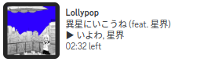
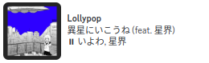

# mprisence

|           | Playing                                                   | Paused                                                  |
| --------- | --------------------------------------------------------- | ------------------------------------------------------- |
| No icon   |      |      |
| Show icon |  |  |
| No cover  |    |    |

A Discord Rich Presence client for MPRIS-compatible media players with album/song cover art support

## Installation

### Arch

You can install mprisence from [AUR](https://aur.archlinux.org/packages/mprisence/)

```bash
paru -S mprisence # or any other AUR helpers
```

### Other

You can install mprisence from the source by

#### Using my script

```bash
curl -s https://raw.githubusercontent.com/lazykern/mprisence/main/scripts/install.sh | bash -s
```

#### Manually (See [autostarting](#autostarting))

```bash
cargo install --git "https://github.com/lazykern/mprisence.git"
```

## Usage

To start mprisence, simply run this command:

```bash
mprisence
```

See also:

- [**Cover Art**](#cover-art).
- [Autostarting](#autostarting).

## Configuration

The rich presence can be configured to the user's preference by providing the configuration file at `~/.config/mprisence/config.toml` or `$XDG_CONFIG_HOME/mprisence/config.toml`.

See [Example config file](config/example.toml) for more details on configuration.

To download the example config file:

```bash
curl -s https://raw.githubusercontent.com/lazykern/mprisence/main/scripts/example-config.sh | bash -s
```

See also:

- [Default config file](config/default.toml)

### Cover Art

#### MusicBrainz

The cover art will be fetched from [MusicBrainz](https://musicbrainz.org/) API. Note that the result is not guaranteed to always be available nor correct.
To reduce the chance of missing cover art:

- Make sure the tags of the music files are identical to the [MusicBrainz database](https://musicbrainz.org)
- Use ImgBB as the cover art provider (See below)

#### ImgBB

Will upload the cover art from player metadata or audio tag to [ImgBB](https://imgbb.com/) and use the uploaded image as the cover art.

The user must set the [ImageBB API key](https://api.imgbb.com/) in the [configuration file](#configuration) by providing the key as below.
And make sure to add `provider = ["imgbb"]` to `[cover.provider]` in the [config file](#configuration).

```toml
[cover.provider.imgbb]
api_key = "<YOUR API KEY>"
```

### Note

The application **must be restarted** after the configuration file is updated

## Autostarting

For most Linux distributions, you can use [systemd](https://wiki.archlinux.org/title/Systemd) to autostart mprisence.

### Installed from AUR

```
systemctl --user enable --now mprisence.service
```

### Installed from source

#### Using my script

```bash
curl -s https://raw.githubusercontent.com/lazykern/mprisence/main/scripts/autostart.sh | bash -s
```

#### Manually

```bash
sudo ln -s $(which mprisence) /usr/local/bin/mprisence
mkdir -p "$HOME/.config/systemd/user"
curl https://raw.githubusercontent.com/lazykern/mprisence/main/systemd/mprisence-local.service >"$HOME/.config/systemd/user/mprisence.service"
systemctl --user daemon-reload
systemctl --user enable --now mprisence.service
```

If the configuration file is updated, you must restart the service

```bash
systemctl --user restart mprisence.service
```
