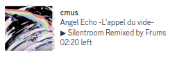

# mprisence

A Discord Rich Presence client for MPRIS-compatible media players with album/song cover art support

| Playing                                       | Paused + Show player icon                                   |
| --------------------------------------------- | ----------------------------------------------------------- |
|  |  |

## Installation

### With cargo

```bash
  cargo install --git https://github.com/phusitsom/mprisence.git
```

## Usage

To start mprisence, simply run this command:

```bash
mprisence
```

## Cover art support

In order to enable album cover support, user must set the [ImageBB API key](https://api.imgbb.com/) in the [configuration file (see section below)](#configuration) by providing the key as below

```toml
[image.provider.imgbb]
api_key = "<YOUR API KEY>"
```


## Configuration

The rich presence can be configured to the user's preference by providing the configuration file at `~/.config/mprisence/config.toml` or `$XDG_CONFIG_HOME/mprisence/config.toml`.

See [documentation](https://github.com/phusitsom/mprisence/wiki/Configuration/) for more advanced configuration.

To download example config file:
```bash
CONFIG_PATH="${XDG_CONFIG_HOME:-$HOME/.config}/mprisence/config.toml"
[ ! -f "$CONFIG_PATH" ] && curl -o "$CONFIG_PATH" --create-dirs "https://raw.githubusercontent.com/phusitsom/mprisence/main/config/example.toml"
```
### Note

The application **must be restarted** after the configuration file is updated

### See also

- [Example config file](config/example.toml)
- [Default config file](config/default.toml)
