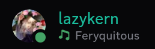

<!-- prettier-ignore -->
<div align="center">


# mprisence

**Discord Rich Presence for Linux media players**

[](https://crates.io/crates/mprisence)
[](https://aur.archlinux.org/packages/mprisence)
[](https://search.nixos.org/packages?query=mprisence)
[](LICENSE)

[Overview](#overview) • [Supported players](#supported-players) • [Quick start](#quick-start) • [Configuration](#configuration) • [Web players](#web-players) • [Development](#development) • [Troubleshooting](#troubleshooting)

</div>

Reads MPRIS metadata over D-Bus → renders Discord Rich Presence → syncs with current media.

Works with **VLC, MPV, Rhythmbox, Strawberry, CMUS, MPD, and more**. Has a [browser bridge](#web-players) for web players (YouTube Music, SoundCloud, etc.) when browser MPRIS is not enough.

<p align="center">
  
  <br/>
  <em>Local player → Discord status, no config needed</em>
</p>

> [!IMPORTANT]
> Discord must allow activity sharing: **Settings → Activity Privacy → Display current activity as a status message**.

## Overview

### How it works

```text
local player or browser tab
  → MPRIS metadata on D-Bus
  → mprisence
  → Discord Rich Presence
```

Browser bridge path (optional — see [Web players](#web-players)):

```text
supported website
  → browser extension
  → MPRIS bridge (native host)
  → mprisence
  → Discord Rich Presence
```

### Highlights

- No config required for common local-player setups
- Handlebars templates for title, artist, album, player name, status, duration, IDs, and more
- Per-player and per-site overrides for app ID, icon, activity type, streaming policy, and status text
- Cover art from metadata, local files, Catbox/Litterbox, MusicBrainz, or ImgBB
- Hot reload for most config changes
- Browser bridge for better metadata, cover art, URLs, and controls on web players

## Supported players

Bundled presets in [`config/config.default.toml`](./config/config.default.toml). No setup needed — start `mprisence` and these appear in Discord automatically.

**Local players (MPRIS):** Audacious, Amberol, Clementine, CMUS, Elisa, Euphonica, Feishin, Fooyin, Gapless, Gelly, Haruna, Harmony Music, Kew, Lollypop, Media Player Classic Qute Theater, MPV, MPD, Musikcube, MusicBee, QMMP, Quod Libet, Quester, Rhythmbox, AmpCast, SMPlayer, Spotify (legacy), Strawberry, Supersonic, VLC.

**Web players (browser bridge):** YouTube Music, YouTube, SoundCloud, Bandcamp, Tidal, Apple Music, Qobuz, Amazon Music, Deezer, Yandex Music. Add your own under `[web_player.*]` with `match_patterns`.

## Quick start

> [!NOTE]
> This covers **local media players** (VLC, MPV, Strawberry, etc.).
> For web players (YouTube Music, SoundCloud, etc.), see [Web players](#web-players).

### 1. Install

#### Arch Linux

```bash
yay -S mprisence
# or: yay -S mprisence-bin
```

#### Nix / NixOS

```bash
# without flakes
nix-env -iA nixpkgs.mprisence

# with flakes
nix profile install nixpkgs#mprisence
```

#### Debian / Ubuntu

Download `.deb` from [GitHub Releases](https://github.com/lazykern/mprisence/releases), then:

```bash
sudo dpkg -i /path/to/mprisence_*.deb
```

#### crates.io

```bash
cargo install mprisence
```

#### From source

```bash
git clone https://github.com/lazykern/mprisence.git
cd mprisence
cargo install --path .
```

### 2. Start it

```bash
mprisence
```

Run in foreground first to verify it picks up your player. Stop with Ctrl+C.

### 3. Verify

Start media playback, then in another terminal:

```bash
mprisence players list
mprisence players list --detailed
```

If you see your player listed, Discord shows your activity within seconds.

Example:
```
$ mprisence players list --detailed
Name       Identity               Bus Name                                    Source
────       ────────               ────────                                    ──────
VLC        vlc_media_player       org.mpris.MediaPlayer2.vlc                  D-Bus
Strawberry strawberry           org.mpris.MediaPlayer2.strawberry          D-Bus
```

### 4. Enable as a service (optional)

```bash
systemctl --user enable --now mprisence.service
```

If your package did not include a service file:

```bash
mkdir -p ~/.config/systemd/user
curl -o ~/.config/systemd/user/mprisence.service \
  https://raw.githubusercontent.com/lazykern/mprisence/main/mprisence.service
systemctl --user daemon-reload
systemctl --user enable --now mprisence.service
```

Check service status:

```bash
systemctl --user status mprisence
journalctl --user -u mprisence -f
```

## Configuration

> [!TIP]
> No config file needed for first run. Create one for overrides.

Config path: `~/.config/mprisence/config.toml`

Start from example config:

```bash
mkdir -p ~/.config/mprisence
curl -o ~/.config/mprisence/config.toml \
  https://raw.githubusercontent.com/lazykern/mprisence/main/config/config.example.toml
```

Reference files:
- [`config/config.example.toml`](./config/config.example.toml) — documented example
- [`config/config.default.toml`](./config/config.default.toml) — bundled player and web-player presets
- [`src/metadata.rs`](./src/metadata.rs) — template variable reference

### Common knobs

- `template.details`, `template.state`, `template.large_text`, `template.small_text`
- `[player.*]` — overrides for specific local players
- `[activity_type]` and `[time]` — Discord display behavior
- `[cover.provider]` — cover-art sources

Example: show track title in Discord status instead of player name:

```toml
[player.default]
status_display_type = "details"
```

### Status display types

`status_display_type` controls which text Discord shows in your status:

| Mode | Preview |
|------|---------|
| `name` — player/app name |  |
| `state` — `template.state` render (default: artists) |  |
| `details` — `template.details` render (default: title) |  |

### Inspect resolved config

```bash
mprisence config
```

Web-player config options (`[web_player.*]`) are documented in the [Web players](#web-players) section.

## Web players

mprisence supports two paths for browser media. Try Browser MPRIS first; switch to the bridge if metadata or controls are lacking.

| | Browser MPRIS | Bridge + extension |
|---|---|---|
| Setup | None | Native host + extension |
| Metadata | Title, maybe artist, URL | Title, artist, album, cover, canonical URL |
| Controls | Play/pause | Full (prev, next, seek) |
| Works with | Any browser with MPRIS support | Bundled sites + presets |

### Bridge + extension

Use this path for richer title, cover art, canonical URL, duration, and controls.

Bundled site support includes:
- YouTube Music, YouTube, SoundCloud, Bandcamp, TIDAL, Apple Music
- Plus presets for Deezer, Qobuz, Amazon Music, Yandex Music, and more

#### Install native host

```bash
cargo build --release -p mprisence   # or install from Releases / AUR / Nix
./target/release/mprisence web install
./target/release/mprisence web doctor
```

#### Install extension

- **Firefox:** [mprisence bridge on AMO](https://addons.mozilla.org/en-US/firefox/addon/mprisence-bridge/)
- **Chrome / Chromium:** [mprisence bridge on Chrome Web Store](https://chromewebstore.google.com/detail/pnkkjbdopihogobhhjbgapbpfccinjjo)

Open a supported site (e.g. music.youtube.com) and play a track. Check with `playerctl -l | grep mprisence_web`.

<details>
<summary>Development: build and load unpacked</summary>

```bash
cd extension
npm install
npm run build:firefox   # or: npm run build:chromium
```

- **Firefox:** `about:debugging#/runtime/this-firefox` → **Load Temporary Add-on** → `extension/dist/firefox/manifest.json`
- **Chromium:** `chrome://extensions` → Developer mode → **Load unpacked** → `extension/dist/chromium/`

Reloading the extension kills content scripts on existing tabs. Refresh media tabs after reload.

</details>

#### Debugging

```bash
playerctl -l | grep mprisence_web
tail -f /tmp/bridge-stderr.log
```

For full detail: [`extension/README.md`](./extension/README.md)

### Browser MPRIS

Some browsers expose media tabs as MPRIS players with page URL metadata. When quality is adequate, mprisence matches these against `[web_player.*]` presets.

Check what your browser exposes:

```bash
playerctl -l
mprisence players list --detailed
```

Enable specific sites via config.

Bundled site (patterns inherited from bundled entry — un-ignore to activate):

```toml
[web_player.youtube]
ignore = false
```

Custom site (not in bundle — provide match_pattern and app_id):

```toml
[web_player.my_site]
match_pattern = "mysite.com"
name = "My Site"
app_id = "YOUR_DISCORD_APP_ID"
icon = "https://mysite.com/icon.png"
ignore = false
```

## Development

### Build workspace

```bash
cargo build --release -p mprisence
./target/release/mprisence web install
cd extension && npm install && npm run build:firefox
```

### Repository layout

| Path | Purpose |
| --- | --- |
| [`src/`](./src) | core daemon: MPRIS discovery, metadata, cover art, config, Discord presence |
| [`src/web_bridge/`](./src/web_bridge) | native host mode for browser sources |
| [`extension/`](./extension) | browser extension for supported web players |
| [`config/`](./config) | bundled defaults and example config |
| [`tests/`](./tests) | integration and metadata tests |
| [`packaging/`](./packaging) | packaging scripts and distro assets |

### Useful commands

```bash
# verbose logging
RUST_LOG=debug mprisence
RUST_LOG=trace mprisence

# validate version string logic
mprisence version validate 1.7.0-beta.3
```

## Troubleshooting

### Discord activity not showing

Check:

1. Discord desktop client running
2. Activity-sharing setting enabled
3. `mprisence` process or service running
4. Player visible in `mprisence players list`
5. Logs show no errors

```bash
systemctl --user status mprisence
mprisence players list --detailed
journalctl --user -u mprisence -f
```

### Player detected, but presence still hidden

Player may be ignored by config or blocked as streaming source.

```bash
mprisence config
mprisence players list --detailed
```

Add matching `[player.*]` override or adjust `[web_player.*]` entry.

### Browser tab missing or wrong

- Browser MPRIS path: browser may not expose enough metadata
- Bridge path: extension may not be loaded, native host may not be installed, or tab may need refresh after extension reload

Useful checks:

```bash
playerctl -l
playerctl -l | grep mprisence_web
./target/release/mprisence web doctor
tail -f /tmp/bridge-stderr.log
```

### Cover art missing

```bash
RUST_LOG=debug mprisence
rm -rf ~/.cache/mprisence/cover_art
```

Then verify provider config and metadata quality.

### Flatpak Discord clients

If you use Vesktop Flatpak, native IPC may need extra setup. See Vesktop guide for native applications:
<https://github.com/flathub/dev.vencord.Vesktop?tab=readme-ov-file#native-applications>

If problem persists, open an issue with:

- player name and `mprisence players list --detailed` output
- relevant config snippet
- logs from `journalctl --user -u mprisence -f`
- bridge logs if browser path involved
